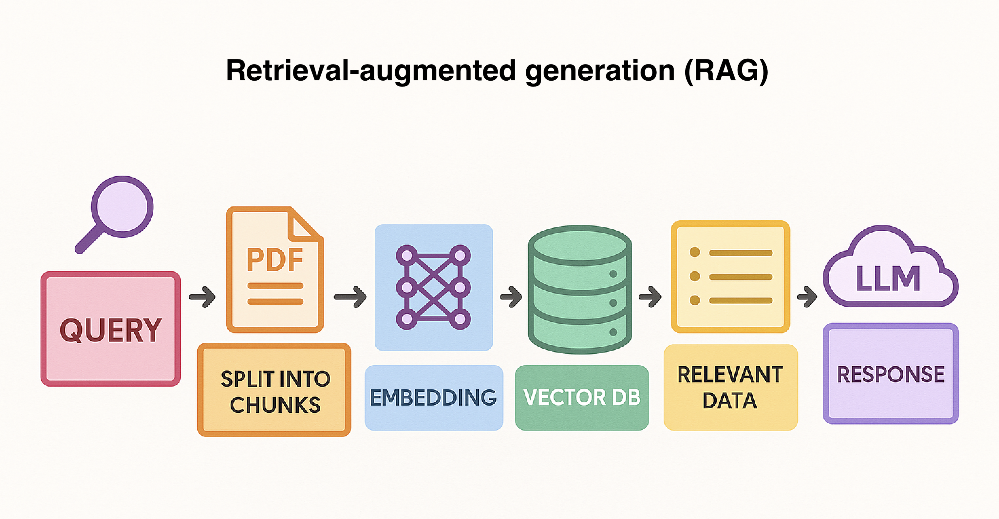

---

# 🚀 ollamaRAG: Local Retrieval-Augmented Generation with LangChain & Ollama

Welcome to the **ollamaRAG**!  

This project demonstrates how to build a local, privacy-friendly Retrieval-Augmented Generation (RAG) system using [LangChain](https://www.langchain.com/), [Ollama](https://ollama.com/), and [ChromaDB](https://www.trychroma.com/).  

No cloud. No subscriptions. No privacy worries.
Just drop in your PDFs and get instant, accurate answers-powered by cutting-edge open-source AI.



---

## 🌟 Why Use This?
- Own your data: Everything runs locally; your files never leave your machine.

- Save money: No API keys, no usage fees-Ollama models are free and fast.

- Boost productivity: Instantly search, summarize, and understand your documents-contracts, research, manuals, and more.

- Flexible: Swap models, add new files, and extend the system to fit your needs.

---

## 🗂️ Project Structure

```
ollamaRAG/
│
├── chroma_db/                   # Fast, local vector storage (auto-generated)
├── data/                        # Drop your PDF files here
├── docs
│   └── rag-diagram.png
├── src/                         # Source code
│   ├── main.py                  # Main entry point
│   └── reset_chroma_db.py       # Reset your vector DB instantly
├── .gitignore
├── README.md
└── requirements.txt
```

---

## ⚡ Quickstart

### 1. **Install Dependencies**

```bash
pip install -r requirements.txt
```

### 2. **Set Up Ollama**

- [Download and install Ollama](https://ollama.com/download) for your OS.

- Pull a model:
  ```bash
  ollama pull phi4-mini-reasoning:latest
  # or
  ollama pull mistral-small3.1:24b-instruct-2503-q8_0
  # or
  ollama pull gemma3:27b-it-q4_K_M
  ```
- Pull the embedding model:
  ```bash
  ollama pull nomic-embed-text:latest
  ```

### 3. **Add Your PDFs**

- Place your PDFs in the data/ folder.
(Set DELETE_PDF = False in code if you want to keep your originals.)

### 4. **Run the Project**

```bash
python src/main.py
```
- Your PDFs are ingested, indexed, and ready for question-answering!


### 5. **Reset the chroma_db**
```bash
python reset_chroma_db.py
```
- Start fresh anytime.


---

## 🧠 How It Works
1. PDFs are split into chunks for better context.
2. Chunks are embedded into vectors using Ollama.
3. ChromaDB stores vectors for lightning-fast search.
4. LangChain RAG finds the best chunks and generates answers with your chosen AI model.

---

## 📝 Example Query

Ask questions like:
- “What are the main findings in my research.pdf?”
- “Summarize the contract in plain English.”
- “Give me a list of key terms from all documents.”

---

## 🛠️ Customize Easily

- **Change the AI model by editing LLM_MODEL in the code.** 
- Add more document types or a web UI as your project grows.

---

## 🛡️ Privacy & Security

- **100% local: No data ever leaves your computer.**
- **No API keys needed: No hidden costs, no cloud lock-in.**

---

## 📚 Learn More

- [LangChain Documentation](https://python.langchain.com/docs/)
- [Ollama Documentation](https://ollama.com/)
- [ChromaDB Documentation](https://docs.trychroma.com/)

---

## 🤝 Contributing

Pull requests, issues, and suggestions are welcome!  
Feel free to fork and build on this project.

---

## 📄 License

MIT License

---

**Happy building! 🚀**  
*If you use this project, let me know or share your results!*

---